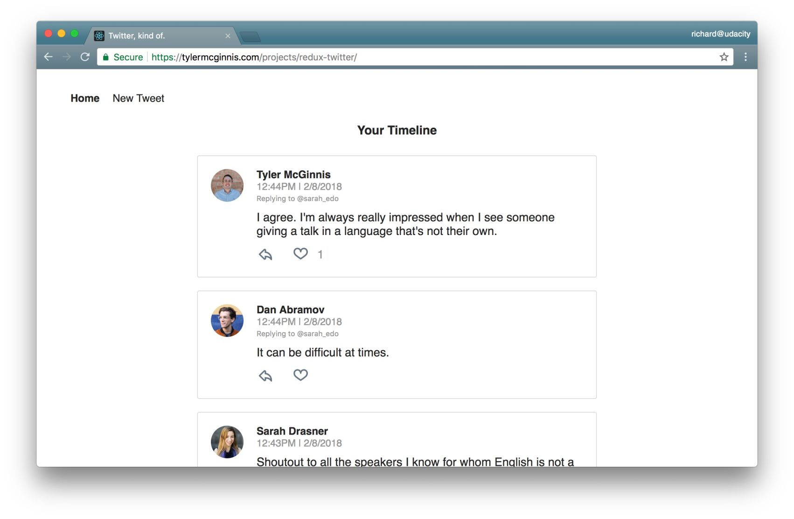
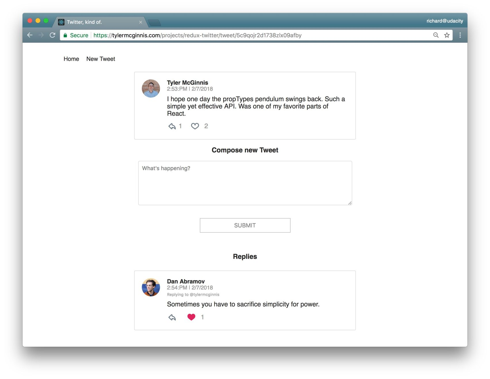
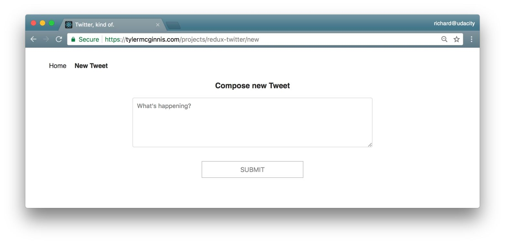
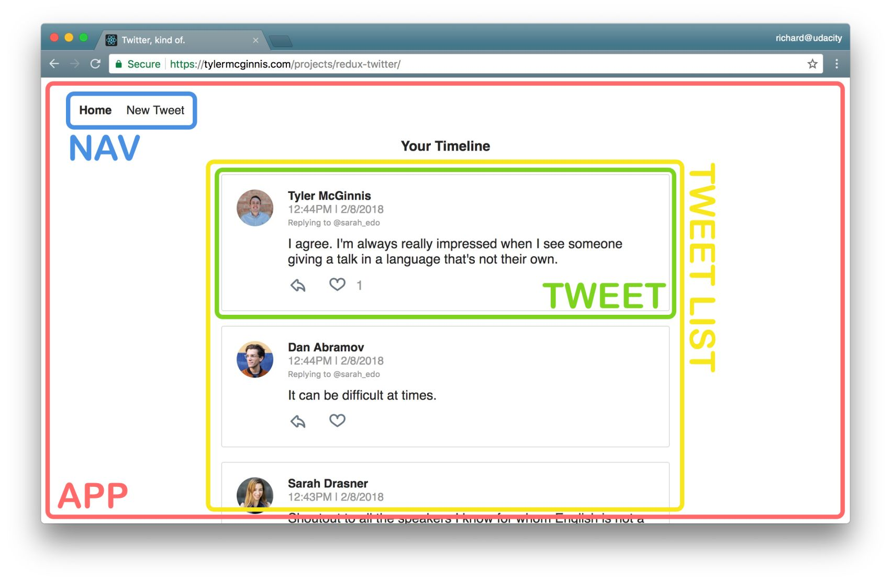
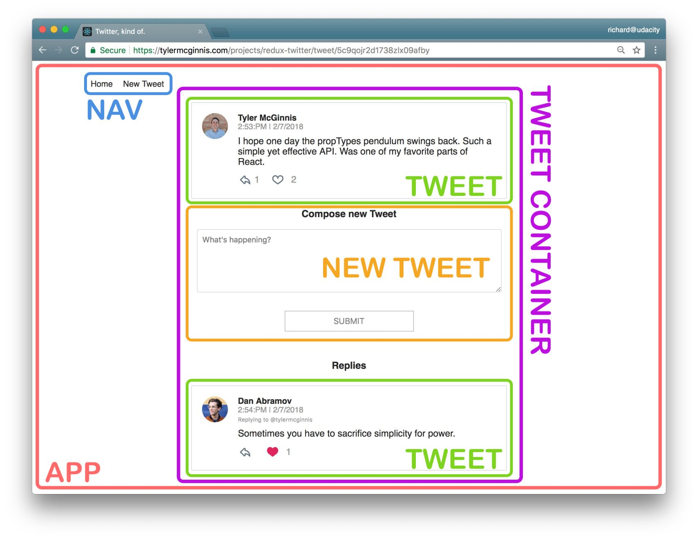
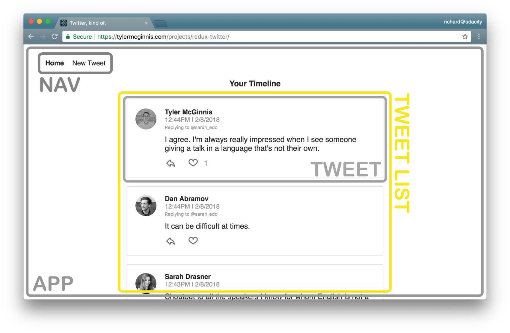
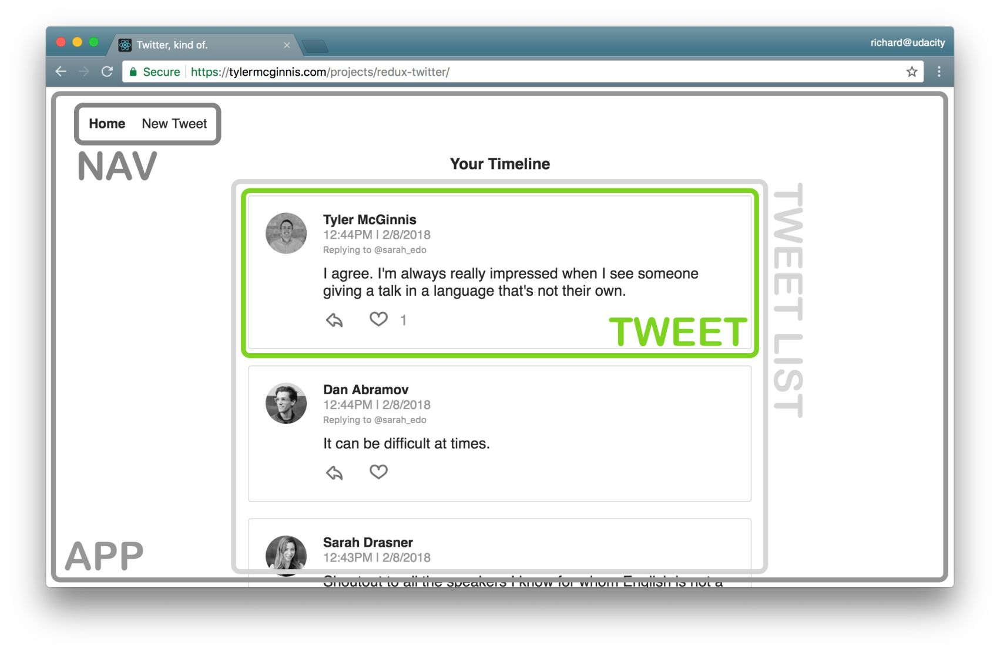
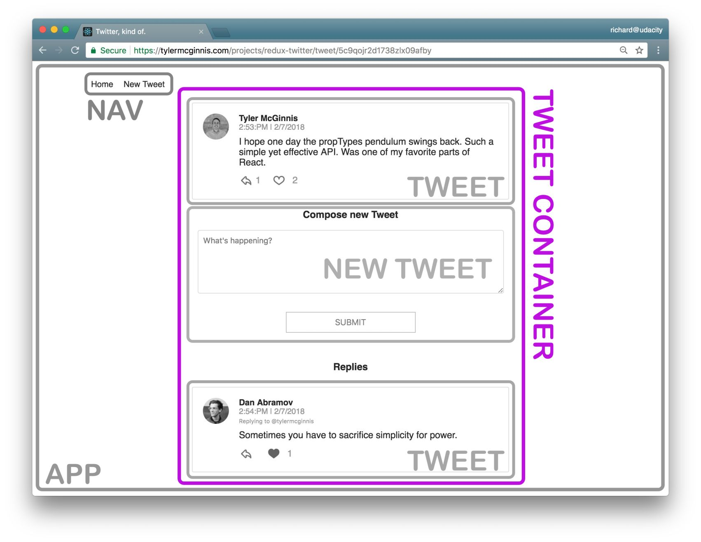
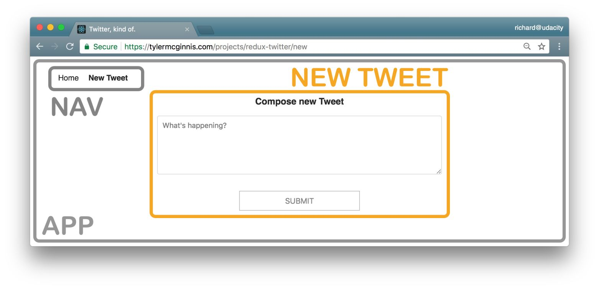

# Chirper Project

This repo is a code-along with the first project in the [React Nanodegree program](https://www.udacity.com/course/react-nanodegree--nd019).

Most of the commits in this repository correspond to videos in the program.

## Project Setup

* clone the Project - `git@github.com:udacity/reactnd-chirper-app.git`
* install the dependencies - `npm install`

## Contributing

Because this is a code-along project and the commits correspond to specific videos in the program, we will not be accepting pull requests.

If you feel like there's a major problem, please open an issue to discuss the problem and potential resolution.

## License

MIT

## Project planning

1. Identify What Each View Should Look Like
2. Hierarchy of Components
3. What Events Happen in the App
4. What Data Lives in the Store

### Identify What Each View Should Look Like

#### Dashboard

This view displaying the navigation and tweets.

Dashboard View Requirements:
- is located at the home route (/)
- shows tweets sorted from most recently added at the top, to oldest at the bottom

Each tweet will show:
- the author
- the time stamp
- who the author is replying to
- the text of the tweet
- a reply button - with the number of replies (if higher than 0)
- a like button - with the number of likes (if higher than 0)

#### Tweet Page

This view displaying a single tweet.

Tweet Page View Requirements:
- is located at /tweet/:id
- shows an individual tweet
- the author
- the time stamp
- a reply button - with the number of replies (if higher than 0)
- a like button - with the number of likes (if higher than 0)
- has a reply form
- shows all reply tweets

#### Creating a New Tweet

This view displaying create new tweet form.

The New Tweet View Requirements:
- is located at /new
- has a textbox for adding a new tweet

### Hierarchy of components for each view

#### Dashboard View

- **App** - the overall container for the project
- **Navigation** - displays the navigation
- **Tweets List** - responsible for the entire list of tweets
- **Tweet** - in charge of display the content for a single tweet

#### Tweet View

- **App** - the overall container for the project
- **Navigation** - displays the navigation
- **Tweet Container** - displays a list of tweets
- **Tweet** - displays the content for a single tweet
- **New Tweet** - display the form to create a new tweet (reply)

#### New Tweet View

- **App** - the overall container for the project
- **Navigation** - displays the navigation
- **New Tweet** - display the form to create a new tweet

#### All Components
The application will have the following components:

- App
- Navigation
- Tweets List
- Tweet Container
- Tweet
- New Tweet

### What Events Happen in the App

