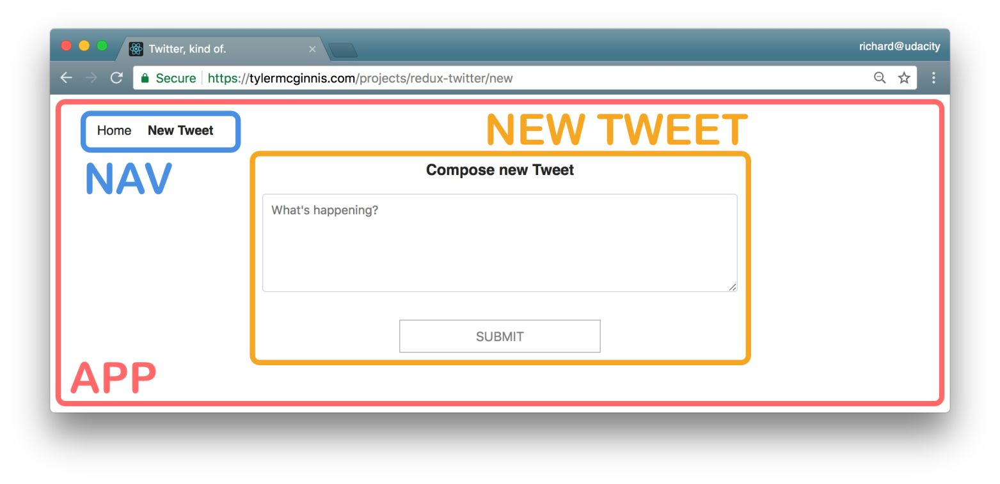

# Chirper Project

This repo is a code-along with the first project in the [React Nanodegree program](https://www.udacity.com/course/react-nanodegree--nd019).

Most of the commits in this repository correspond to videos in the program.

## Project Setup

- clone the Project - `git@github.com:udacity/reactnd-chirper-app.git`
- install the dependencies - `npm install`

## Contributing

Because this is a code-along project and the commits correspond to specific videos in the program, we will not be accepting pull requests.

If you feel like there's a major problem, please open an issue to discuss the problem and potential resolution.

## License

MIT

## Project planning

1. Identify What Each View Should Look Like
2. Hierarchy of Components
3. What Events Happen in the App
4. What Data Lives in the Store

### Identify What Each View Should Look Like

#### Dashboard

This view displaying the navigation and tweets.


Dashboard View Requirements:

- is located at the home route (/)
- shows tweets sorted from most recently added at the top, to oldest at the bottom

Each tweet will show:

- the author
- the time stamp
- who the author is replying to
- the text of the tweet
- a reply button - with the number of replies (if higher than 0)
- a like button - with the number of likes (if higher than 0)

#### Tweet Page

This view displaying a single tweet.


Tweet Page View Requirements:

- is located at /tweet/:id
- shows an individual tweet
- the author
- the time stamp
- a reply button - with the number of replies (if higher than 0)
- a like button - with the number of likes (if higher than 0)
- has a reply form
- shows all reply tweets

#### Creating a New Tweet

This view displaying create new tweet form.


The New Tweet View Requirements:

- is located at /new
- has a textbox for adding a new tweet

### Hierarchy of components for each view

#### Dashboard View


- **App** - the overall container for the project
- **Navigation** - displays the navigation
- **Tweets List** - responsible for the entire list of tweets
- **Tweet** - in charge of display the content for a single tweet

#### Tweet View


- **App** - the overall container for the project
- **Navigation** - displays the navigation
- **Tweet Container** - displays a list of tweets
- **Tweet** - displays the content for a single tweet
- **New Tweet** - display the form to create a new tweet (reply)

#### New Tweet View



- **App** - the overall container for the project
- **Navigation** - displays the navigation
- **New Tweet** - display the form to create a new tweet

#### All Components

The application will have the following components:

- App
- Navigation
- Tweets List
- Tweet Container
- Tweet
- New Tweet

### What Events Happen in the App

#### Tweets List Component


For the Tweets List component, the only information that we see is that we'll have to get a list of all of the tweets. So for this component, we just need to:

- get the tweets

So the action type for event this will probably be something like **GET_LIST_OF_TWEETS** or **GET_DATA**.

#### Tweet Component


- We get a particular tweet from a list of tweets.
- We get the authedUser (user that is currently logged in) so the user can toggle the likes on each tweet.
- We get the authedUser so the user can reply to a tweet.

#### Tweet Container Component


- We get a specific tweet from a list of tweets.
- We get the replies to a specific tweet from a list of tweets.

#### New Tweet Component


- We get the authedUser so the user can create a new tweet.
- We set the text of the new tweet.

### What Data Lives in the Store

Looking at our initial tweet and user data:

```
let tweets = {
  "8xf0y6ziyjabvozdd253nd": {
    id: "8xf0y6ziyjabvozdd253nd",
    text: "Shoutout to all the speakers I know for whom English is not a first language, but can STILL explain a concept well. It's hard enough to give a good talk in your mother tongue!",
    author: "sarah_edo",
    timestamp: 1518122597860,
    likes: ['tylermcginnis'],
    replies: ['fap8sdxppna8oabnxljzcv', '3km0v4hf1ps92ajf4z2ytg'],
    replyingTo: null,
  }
}

let users = {
  sarah_edo: {
    id: "sarah_edo",
    name: "Sarah Drasner",
    avatarURL: "https://tylermcginnis.com/would-you-rather/sarah.jpg",
    tweets: ['8xf0y6ziyjabvozdd253nd', 'hbsc73kzqi75rg7v1e0i6a', '2mb6re13q842wu8n106bhk', '6h5ims9iks66d4m7kqizmv', '3sklxkf9yyfowrf0o1ftbb'],
  }
}
```

According to the Redux documentation, here are the principles of state normalization:

- Each type of data gets its own "table" in the state.
- Each "data table" should store the individual items in an object, with the IDs of the items as keys and the items themselves as the values.
- Any references to individual items should be done by storing the item's ID.
- Arrays of IDs should be used to indicate ordering.


In our application, normalized state would look like this:

```
{
  tweets: {
    tweetId: { tweetId, authorId, timestamp, text, likes, replies, replyingTo},
    tweetId: { tweetId, authorId, timestamp, text, likes, replies, replyingTo}
  },
  users: {
    userId: {userId, userName, avatar, tweetsArray},
    userId: {userId, userName, avatar, tweetsArray}
  }
}
```

Each Tweet Component needs to show whether the logged in used has liked a tweet. In order to do that, we need to know who the logged in user is. From looking at our Component Hierarchy, we know that the Tweet Component gets used by multiple components. Therefore, we need to upgrade this component to a container so it could access the authedUser piece of data from the store to see whether to show a red heart.

Another reason we would want to keep the authedUser piece of data in the store is that if we extend our application to include the ability to sign in and sign out, this functionality would be easy to manage with Redux.

The Store contains:  
- **tweets property**
- **users property**
- **authedUser property**.


